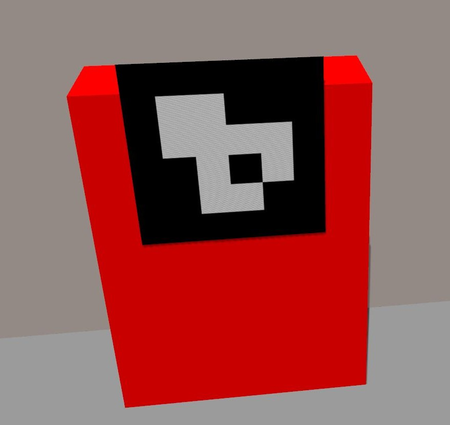

# robo_ads_assignment

## Objective:

Write custom ROS nodes for Autonomous Docking/Charging of
Turtlebot3 Robot, within a simulated Gazebo world environment. The system should enable the robot to autonomously navigate back to the docking station, when the battery level is below 30%. Utilize ArUco Marker/AR Tag Transformation for localization of the docking station within the map. Utilize a depth camera and laser scanner for precise positioning of the robot with the center of the docking station.

### Hardware Used
  - i5 8th Gen
  - Nvidia GPU - GTX or RTX series

### Software Used
  -  Ubuntu 20.04
  -  ROS Noetic Ninjemys
  -  Gazebo


### Setup
Follow the steps.
- Open the terminal and run the following commands
```bash
mkdir (your_workspace_name)
cd (your_workspace_name)
mkdir src
cd src
git clone https://github.com/ravikrcsia/robo_ads.git
cd ~/(your_workspace_name)
catkin build
```

### Docking Station Model used



You can find the model file in `turtlebot3_gazebo/models/aruco_marker`